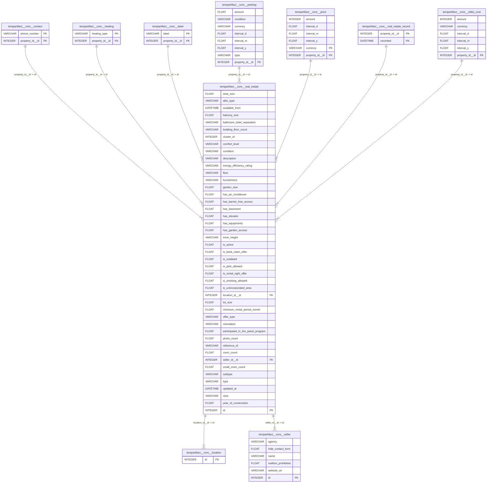

```mermaid
erDiagram
  tempartifact__core__contact {    
    VARCHAR phone_number PK     
    INTEGER property_id__id PK 
  }
  tempartifact__core__real_estate {    
    FLOAT area_size      
    VARCHAR attic_type      
    DATETIME available_from      
    FLOAT balcony_size      
    VARCHAR bathroom_toilet_separation      
    VARCHAR building_floor_count      
    INTEGER cluster_id      
    VARCHAR comfort_level      
    VARCHAR condition      
    VARCHAR description      
    VARCHAR energy_efficiency_rating      
    VARCHAR floor      
    VARCHAR furnishment      
    FLOAT garden_size      
    FLOAT has_air_conditioner      
    FLOAT has_barrier_free_access      
    FLOAT has_basement      
    FLOAT has_elevator      
    FLOAT has_equipments      
    FLOAT has_garden_access      
    VARCHAR inner_height      
    FLOAT is_active      
    FLOAT is_bank_claim_offer      
    FLOAT is_outdated      
    FLOAT is_pets_allowed      
    FLOAT is_rental_right_offer      
    FLOAT is_smoking_allowed      
    FLOAT is_unincorporated_area      
    INTEGER location_id__id FK     
    FLOAT lot_size      
    FLOAT minimum_rental_period_month      
    VARCHAR offer_type      
    VARCHAR orientation      
    FLOAT participated_in_the_panel_program      
    FLOAT photo_count      
    VARCHAR reference_id      
    FLOAT room_count      
    INTEGER seller_id__id FK     
    FLOAT small_room_count      
    VARCHAR subtype      
    VARCHAR type      
    DATETIME updated_at      
    VARCHAR view      
    FLOAT year_of_construction      
    INTEGER id PK 
  }
  tempartifact__core__location {    
    INTEGER id PK 
  }
  tempartifact__core__seller {    
    VARCHAR agency      
    FLOAT hide_contact_form      
    VARCHAR name      
    FLOAT realtors_prohibited      
    VARCHAR website_url      
    INTEGER id PK 
  }
  tempartifact__core__heating {    
    VARCHAR heating_type PK     
    INTEGER property_id__id PK 
  }
  tempartifact__core__label {    
    VARCHAR label PK     
    INTEGER property_id__id PK 
  }
  tempartifact__core__parking {    
    FLOAT amount      
    VARCHAR condition      
    VARCHAR currency      
    FLOAT interval_d      
    FLOAT interval_m      
    FLOAT interval_y      
    VARCHAR type      
    INTEGER property_id__id PK 
  }
  tempartifact__core__price {    
    INTEGER amount      
    FLOAT interval_d      
    FLOAT interval_m      
    FLOAT interval_y      
    VARCHAR currency PK     
    INTEGER property_id__id PK 
  }
  tempartifact__core__real_estate_record {    
    INTEGER property_id__id PK     
    DATETIME recorded PK 
  }
  tempartifact__core__utility_cost {    
    INTEGER amount      
    VARCHAR currency      
    FLOAT interval_d      
    FLOAT interval_m      
    FLOAT interval_y      
    INTEGER property_id__id PK 
  }
  tempartifact__core__contact ||--|{ tempartifact__core__real_estate : "property_id__id -> id"
  tempartifact__core__real_estate ||--|{ tempartifact__core__location : "location_id__id -> id"
  tempartifact__core__real_estate ||--|{ tempartifact__core__seller : "seller_id__id -> id"
  tempartifact__core__heating ||--|{ tempartifact__core__real_estate : "property_id__id -> id"
  tempartifact__core__label ||--|{ tempartifact__core__real_estate : "property_id__id -> id"
  tempartifact__core__parking ||--|{ tempartifact__core__real_estate : "property_id__id -> id"
  tempartifact__core__price ||--|{ tempartifact__core__real_estate : "property_id__id -> id"
  tempartifact__core__real_estate_record ||--|{ tempartifact__core__real_estate : "property_id__id -> id"
  tempartifact__core__utility_cost ||--|{ tempartifact__core__real_estate : "property_id__id -> id"
```

